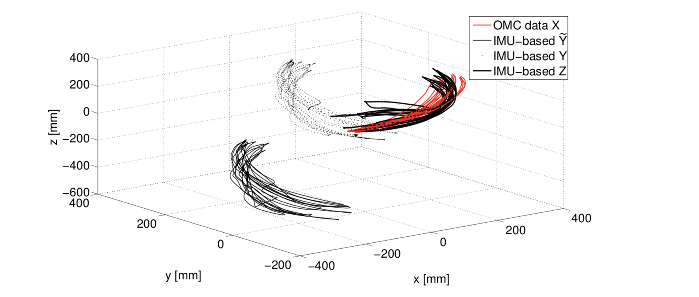

### IMU的仿真

[TOC]

### 开源1[^1]

#### 文献部分

> A novel 7 degrees of freedom model for upper limb kinematic reconstruction based on wearable sensors

近几十年来，可穿戴运动跟踪系统因其在许多领域的有效性而得到了广泛的应用，从性能评估到人机交互，基于惯性传感器的运动跟踪系统得到了广泛的研究。由于惯性传感器受测量漂移的影响，它们需要其他传感器的辅助，因此需要对传感器测量进行融合。最常用的传感器融合技术是基于卡尔曼滤波的。<span style="color:blue;">**特别地，由于大多数模型具有非线性特性，因此采用了扩展卡尔曼滤波（EKF）和无迹卡尔曼滤波（UKF）。**</span>他们通常通过估计肢体的方向来重建人体的运动，包括人体运动学来约束肢体的相对运动。这些模型往往忽略了人体上肢的部分自由度（dof），尤其是在模拟肱骨相对于胸部的运动时。在这篇论文中，我们提出了一个新的7自由度模型，它代表了人类上肢建模精度和复杂性之间的权衡。

> Survey of Motion Tracking Methods Based on Inertial Sensors: A Focus on Upper Limb Human Motion

基于商用惯性测量单元（MUS）的运动跟踪在近几年得到了广泛的研究，因为它对于基于光学技术的运动跟踪不适用的应用是一种经济有效的使能技术。这种测量方法在人的绩效评估和人-机器人交互中具有重要的影响。MU运动跟踪系统确实是独立的和可穿戴的，允许长期跟踪用户在环境中的运动。通过对基于IMU的人体跟踪技术的研究，选择了五种运动重建技术，并对其进行了比较。将MU估计与基于Vicon-marke的运动跟踪系统视为地面真实情况进行匹配。结果表明，除了一个模型外，所有模型的性能都相似（大约35mm的平均位置估计误差）

#### 仿真处理

##### 问题一：比较了什么？

从MIMUS收集的数据为<span style="color:blue;">**第3节中报告**</span>的重建手臂运动学的方法提供了输入。对每种方法的滤波器参数进行了选择，以优化方法的稳定性和准确性。为了能够比较这些方法，根据第4.1.1节中报告的方法，OMC和基于mlimu的位置估计进行了校准。图6显示了如何首先转换基于milmu的数据，以匹配OMC数据，然后旋转以获得与OMC数据的最佳对齐。

> OMC数据是什么？



图6。基于mimu的数据的对齐过程基于mimu的估计（Y）、转换的（Y～）和对齐的（Z）与OMC数据（Z）一起报告

图7显示了ERE功能性运动，并显示了误差E（见等式（28））如何随时间的变化。在这些例子之后，我们报告了误差值以及为比较方法而评分的相关性值，三种功能性运动分别是EFE、SFE、SAA。第一个运动允许我们评估当只有一个运动链关节和一个MIMU运动时方法的行为。后两种方法涉及两个MIMU相对于E]E运动的运动，在S]E和SAA运动中，使用运动链的方法所提供的估计值可能与其他方法的估计值相差较大。三个试验中E和C的平均值见表1。为了更详细地了解这些方法的性能，进一步研究了EFE功能运动。它被分成几个循环：循环1-7以较低的速度进行，而后两个以较高的速度进行。图8显示了误差E在EFE试验周期内的分布情况，而表2给出了相同周期内E和C的平均值（见等式（28））

[^1]: https://github.com/eruffaldi/imu_comparison_data

### 开源2[^2]

[^2]: https://github.com/miguelrasteiro/IMU_dataset

 ```python
% boxplot
err = [mean(MPU9150.error(1:2900,:),2) , mean(SENTRAL.error(1:2900,:) ,2),mean( XSENS.error(1:2900,:),2)];
figure;boxplot(err)
 ```

