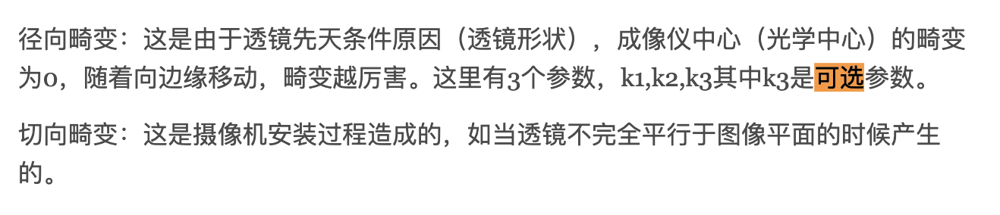

### 小觅相机SLAM

[TOC]

#### 1.1 安装

- [ubuntu16 小觅双目摄像头 MYNT-EYE-S-SDK安装](https://blog.csdn.net/weixin_42905141/article/details/93031125)
- [官方的说明](https://mynt-eye-s-sdk-docs-zh-cn.readthedocs.io/zh_CN/latest/)文档，https://slightech.github.io/MYNT-EYE-D-SDK/get_points.html
- 官方[sdkgithub](https://github.com/slightech/MYNT-EYE-S-SDK)。
- 安装ROS [Wrapper](https://blog.csdn.net/hehe5485963/article/details/95465871)。
- ROS与深度相机入门教程-在ROS[使用小觅深度相机](https://www.ncnynl.com/archives/201910/3435.html)
- [常见问题](http://support.myntai.com/hc/kb/section/1083598/)（官方）
- [固件升级](https://mynt-eye-s-sdk-docs-zh-cn.readthedocs.io/zh_CN/latest/src/firmware/applicable.html)相关

##### 三、相机标定

参数如下：

- 角点距离：11.5mm

- 基线：120mm

**利用python标定结果**：

```
ml =  [[366.08629601   0.         397.57931238]
 [  0.         365.60818098 224.53173267]
 [  0.           0.           1.        ]]
mr =  [[366.77515142   0.         398.37127348]
 [  0.         366.21770184 225.05616056]
 [  0.           0.           1.        ]]
dl =  [[ 0.0076657  -0.04997793  0.00056874  0.00082098  0.06578485]]
dr =  [[-0.01528108  0.01710414  0.00094352 -0.00037146 -0.0095316 ]]
total error:  0.02278824632804879
total error:  0.017575502549360224
[[ 9.99969617e-01 -4.50357979e-04 -7.78219532e-03]
 [ 4.52289051e-04  9.99999867e-01  2.46381705e-04]
 [ 7.78208333e-03 -2.49894020e-04  9.99969688e-01]]
[[-1.20034808e+02]
 [-1.16533862e-02]
 [-6.78247449e-01]]
这个结果是完全可以接受的。
```

<span style="color:blue;">**下面利用kalibr 工具包标定**</span>。

#####  IMU的标定

**问题**：

- kalibr也可以标定IMU？不行，只能联合标定
- 系统误差这些量就不用去管了吗？暂时不用管
- 只需要漂移的误差和白噪声的误差？对的

参考：https://blog.csdn.net/fang794735225/article/details/92804030

 ```python
#1
roslaunch mynteye_wrapper_d display.launch
rosbag record /mynteye/imu/data_raw -O imu.bag
#2
source ./devel/setup.bash
roslaunch imu_utils mynt_imu.launch 
# 3
<launch>
    <node pkg="imu_utils" type="imu_an" name="imu_an" output="screen">
        <param name="imu_topic" type="string" value= "/mynteye/imu/data_raw"/>    #imu topic的名字
        <param name="imu_name" type="string" value= "mynteye"/>   
        <param name="data_save_path" type="string" value= "$(find imu_utils)/data_for_xiaomi/"/>
        <param name="max_time_min" type="int" value= "120"/>   #标定的时长
        <param name="max_cluster" type="int" value= "100"/>
    </node>
</launch>
 ```

最终标定过后的结果：

```python
%YAML:1.0
---
type: IMU
name: A3
Gyr:
   unit: " rad/s"
   avg-axis:
      gyr_n: 2.1054259721173534e-03
      gyr_w: 3.2551642027428387e-05
   x-axis:
      gyr_n: 2.2300241945183976e-03
      gyr_w: 3.6534909304103239e-05
   y-axis:
      gyr_n: 2.1111587932016620e-03
      gyr_w: 3.5510018902145417e-05
   z-axis:
      gyr_n: 1.9750949286320004e-03
      gyr_w: 2.5609997876036516e-05
Acc:
   unit: " m/s^2"
   avg-axis:
      acc_n: 2.6577098898145145e-02
      acc_w: 7.2606692097833129e-04
   x-axis:
      acc_n: 2.1665596323402293e-02
      acc_w: 4.9631604008660202e-04
   y-axis:
      acc_n: 2.4118876978560379e-02
      acc_w: 7.1944374450797540e-04
   z-axis:
      acc_n: 3.3946823392472764e-02
      acc_w: 9.6244097834041634e-04 
```

#####  IMU与相机的联合标定

> 参考：[链接](https://www.jianshu.com/p/27d8c2a164d2)，[这里](https://zhuanlan.zhihu.com/p/44424457)做了一定的总结。主要是利用kalibr工具包。
>
> 主要参考https://blog.csdn.net/weixin_42905141/article/details/99673885。
>
> 另外：https://blog.csdn.net/u011178262/article/details/83316968

rosbag play 时查看有多少话题

````python
rosbag record /mynteye/imu/data_raw -O imu.bag
rosbag record /mynteye/left/image_raw /mynteye/right/image_raw /mynteye/imu/data_raw -O cab_all.bag
````

主要就是输入三个配置文件就行了，然后会输出一堆结果。

```bash
kalibr_calibrate_imu_camera --target april_6x6_80x80cm.yaml --cam xiaomi_camera.yaml --imu imu_cab.yaml --bag cab_all.bag
或者：
kalibr_calibrate_imu_camera \
    --target april_6x6_80x80cm.yaml  \
    --bag  cab_all.bag \
    --bag-from-to 5 45 \
    --cam xiaomi_camera.yaml \
    --imu imu_cab.yaml \
    --imu-models scale-misalignment \
    --timeoffset-padding 0.1
```

**小觅相机与IMU如何同步？**

目前最后一步面临同步的问题，所以暂时先卡在这里了。

##### 重新标定

- [参考](https://github.com/melodicwang/Stereo_IMU_Kalibr/tree/master/Cam_calibration)；

重新标定之后爆出下面的warning：

```python
CHOLMOD warning: matrix not positive definite
```

但是可以一直运行。之后又出现同步的问题，这里将相机拔出之后重新插上，问题解决。

但是最后结果出错。

张振友标定：相机标定的第二个目的就是获得相机的畸变参数，如上式中的** 等，进而对拍摄的图片进行去畸变处理。



#### 1.2 运行ORB-SLAM

>官方：https://github.com/slightech/MYNT-EYE-ORB-SLAM2-Sample

>  报错rosdep：https://ismango.blog.csdn.net/article/details/106049992

>  https://www.cnblogs.com/zxzmnh/p/11758103.html

```python
rosrun ORB_SLAM2 mynteye_s_stereo ./Vocabulary/ORBvoc.txt ./config/mynteye_s_stereo.yaml false /mynteye/left/image_raw /mynteye/right/image_raw 

```

