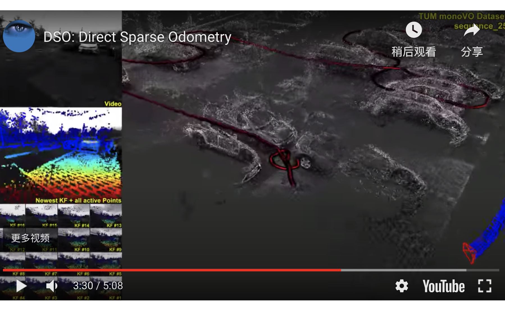

### M1 SLAM综述

[TOC]

#### 1.1 技术方案

对于机器人导航中的测量模型，激光测距仪在测距范围和方位角上都具有较高精度（Range-bearing sensor），对此类传感器获取环境信息的slam技术逐渐成为slam 问题的基础研究。

#### 1.2 相关资料

##### 1 数据集

TUM数据集给出了SLAM的位置的绝对结果

- [一些常见的数据集提供了标准轨迹以对比算法的性能](https://blog.csdn.net/ns2942826077/article/details/105821955)，这个很重要
- [各种数据集的集合](https://blog.csdn.net/crp997576280/article/details/103340020?depth_1-utm_source=distribute.pc_relevant.none-task&utm_source=distribute.pc_relevant.none-task)

- SLAM数据集（tum/kitti）[轨迹对齐与结果评估](https://blog.csdn.net/ns2942826077/article/details/105821955)

| [数据集](https://blog.csdn.net/crp997576280/article/details/103340020?depth_1-utm_source=distribute.pc_relevant.none-task&utm_source=distribute.pc_relevant.none-task) | 特点                                               |      |
| ------------------------------------------------------------ | -------------------------------------------------- | ---- |
| EuRoC[数据集](https://blog.csdn.net/colorsky100/article/details/85331711) | 无人机双目IMU数据集                                |      |
| KITTI数据集                                                  | 双目灰度https://github.com/raulmur/ORB_SLAM2<br /> |      |
|                                                              |                                                    |      |

```
./Examples/Stereo/stereo_kitti Vocabulary/ORBvoc.txt Examples/Stereo/KITTIX.yaml 
```

##### 数据集测试

> [测试](http://www.manongjc.com/article/64743.html)；

> [测试](https://blog.csdn.net/qq_40307605/article/details/104203474?utm_medium=distribute.pc_relevant.none-task-blog-BlogCommendFromMachineLearnPai2-1.channel_param&depth_1-utm_source=distribute.pc_relevant.none-task-blog-BlogCommendFromMachineLearnPai2-1.channel_param)；
>
> 

#### 1.3 相关问题

#### 1.4 相关备注

- 查看pcd文件

```python
pcl_viewer map.pcd
```

#### 1.5 资源收集

- https://blog.csdn.net/lwx309025167/article/details/80421077

  
  
- [泡泡公开课](http://paopaorobot.org/bbs/read.php?tid=117&fid=8)

- <span style="color:blue;">**非常重要的UP主：https://github.com/yuzhou42?tab=repositories**</span>

#### 1.6 算法评估

[参考](https://zhuanlan.zhihu.com/p/105428199)；

### 2 开源项目整理

#### 2.1 已知一致性的EKF

##### 1. aruco [slam](https://zhuanlan.zhihu.com/p/45207081?utm_source=qq&utm_medium=social&utm_oi=726911971793838080)

运行方法

```python
STEP 1. Download the repository to your ROS workspace：catkin_ws/src
STEP 2. Make：catkin_make
roslaunch aruco_ekf_slam slam.launch
rosbag play src/aruco_ekf_slam/aruco_slam_data_qhd1.bag 
```

obs代表目前观测到的路标点，通常为4或者2，说明每次在相机视场之内的观测对象常常为4个。在代码中，作者规定只能选取3m以内的坐标点。

观察`ob.aruco_id_`发现其就是观测到的ID序列，随着时间不断的变化。


同时，作为状态估计的对象mu\_，它的维度一直在发生变化，程序中的处理方法是不断对矩阵F进行resize，从而修改协方差估计的维度。下面说明了`aruco_id_`的变化，不断有新的路标点加入。


所以主要程序的逻辑是：检查是否有新的路标点出现，如果有那么久更新地图以及状态量的维度，如果没有新的路标点的出现，那么利用计算好的雅可比矩阵、协方差矩阵、卡尔曼滤波算法计算状态估计值。

但是为什么需要将观测量使用r和fai来表示？因为如果直接用Tmr矩阵可以直接获得x、y的值（在参考坐标系下），那么又何必多此一举呢？

这就引出一个问题，opencv在处理二维码时，需不需要知道**二维码的确切位置**？也就是说二维码是随意粘贴的还是必须要知道确定位置？从试验的角度来看，应该是随意粘贴二维码位置比较合理一些。此外如果是VIO，地面上的特征点完全是随机的，那么显然不存在一个绝对的惯性参考系这样的说法。

其惯性系应该是小车初始状态下的坐标系，然后还有一个车体坐标系（机器人坐标系），现在逻辑就说的通了。笔者有意将传感器模型与「概率机器人」书中一致（**Range-bearing传感器**），理论上应该也可以转换成为其他传感器模型。

> SIAM 技术首要解决的问题是选择适当的传感器系统对机器人所处的环境进行感知。如激光测距仪、声纳、视觉传感器、GPS、罗盘和里程计等都是较为常用的机载传感器。其中，像激光测距仪这类在测距范围和方位角上都具有较高精确度的传感器（**Range- bearing Sensor**）成为人们优先选用的传感器。因此对使用此类传感器获取环境信息。的 SLAM 技术的研究逐渐成为 SIAM 问题的基础性研究。文中将融合了激光传感器数据的 EKF-SIAM 算法简称为标准 SLAM 算法，相关问题则统称为标准 SLAM 问题

那么如何改造成为“非线形优化”去完成状态估计呢？**这是接下来的一个课题**。

##### 2. IMU+[相机](https://zhuanlan.zhihu.com/p/98472384)数据

#### 2.2 slam十四讲（第九章 - 搭建视觉slam前端）

> RGB-D：RGB色彩模式是工业界的一种颜色标准，是通过对红(R)、绿(G)、蓝(B)三个颜色通道的变化以及它们相互之间的叠加来得到各式各样的颜色的，RGB即是代表红、绿、蓝三个通道的颜色，这个标准几乎包括了人类视力所能感知的所有颜色，是目前运用最广的颜色系统之一。


- slam中比较核心的是**关键帧**，把比较重要的帧保存下来，描述运行轨迹。-->**关键帧的选择问题** 
- 路标点放置在地图中，将新来的帧与地图中的路标点进行匹配，估计相机位姿。帧的位姿与路标的位置估计相当于一个局部slam问题
- map class 中存放了关键帧以及关键路标点

#### 2.3  PF 粒子滤波/蒙特卡罗定位

新的方案利用项目一开始对于系统状态的处理。（待完成）

**gmapping**算法：

运行如下：

```python
source devel/setup.bash
roslaunch particle_filter_localization pf_localization.launch
rosbag play
```

#### 2.4 雷达构建地图

作者完整的重现了雷达构图的问题。主要过程是将「概率机器人」中有关地图珊格的部分进行复现。

虽然得到了完整的结果，但是理论是非常简单的。目前关于雷达SLAM已经有几种做法。一种是基于粒子滤波的，本质上是利用蒙特卡洛的方法对目前的位姿进行搜索；另一种是暴力匹配，通过三层的for循环去寻找地图最为匹配的情况，此时既能够确定位姿又能完成构图，适用于纯激光slam；第三种是基于非线性优化的激光slam，应该理论上更为复杂，也更加实用。

暴力匹配或者粒子滤波的方法还是利用这一帧与下一帧的相似性，找到前后两帧中最为相符的情况下，机器人的位置与姿态。当然也可以利用激光雷达器与里程计的数据去做EKF完成定位。

> 简单的激光[slam](https://www.zhuanzhi.ai/document/65ad7a02f7cb50e0bda6a979d6a86d1d)，暴力搜索。

> 一开始出错是因为配置文件出错。


该项目将「概率机器人」的雷达建图部分进行了仿真。在得到正确位姿之后，利用统计理论求得地图栅格最大MAP值，完成建图。前提是已经获得了准确的位姿，这里讲编码器数据作为正确的位姿。

#### 2.5 简单的VO问题[^1]

> 作业还有几个不错的小项目

结果如下：


#### 2.6 msckf_mono

一步步深入了解MSCKF网址: **[www.xinliang-zhong.vip/msckf_notes/](http://www.xinliang-zhong.vip/msckf_notes/)**，作者介绍了公式的推导过程。这本来是很早以前自己写的一个mono版的msckf. 主要懒得开一个新分支了,就借用了一下.下面对文件夹下的东西说明一下:

Quaternion kinematics for the error-state Kalman filter.pdf 一本自己推导注释过的书

> 作者比较认真的推导了公式内容，可以加以借鉴和学习。

#### 2.7 平面标记的映射与定位(已知一致性的EKF的实现)

主要参考下面几个部分

- [论文参考](https://arxiv.org/pdf/1606.00151.pdf)这部分、
- 已知一致性的Visual-Inertial EKF SLAM [实现](https://zhuanlan.zhihu.com/p/98472384)，这是不错的工作
- [基于平面](https://blog.csdn.net/heyijia0327/article/details/60143160) marker 的 Bundle Adjustmet
- 状态转移参考论文：Quaternion kinematics for the error-state Kalman Filter

> 比较具有参考性的部分就是对于观测矩阵的求导，作者采用和贺博士类似的方法。对于mark的方法应该是比较成熟了，后续可以做实验进行验证。

对上述开源项目进行整理。


<span style="color:blue;">**里面最重要的就是求导问题，可以做出如下解释**</span>。

对于观测矩阵的求导，涉及到对李代数的求导。利用左乘扰动的模型，可以用极限或者直接求导两种方式求导，下面加以实例。

极限求导：
$$
\begin{aligned}
\lim _{\delta \xi \rightarrow 0} \frac{\partial \mathbf{P}_{\mathrm{c}}}{\partial(\delta \xi)} &=\lim _{\delta \xi \rightarrow 0} \frac{\exp \left(\hat{\xi}_{c w}\right)\left[\exp (\hat{\delta} \xi) \exp \left(\hat{\xi}_{m w}\right)\right]^{-1} \mathbf{P}_{\mathbf{m}}-\exp \left(\hat{\xi}_{c w}\right)\left[\exp \left(\hat{\xi}_{m w}\right)\right]^{-1} \mathbf{P}_{\mathbf{m}}}{\delta \xi} \\
&=\lim _{\delta \xi \rightarrow 0} \frac{\exp \left(\hat{\xi}_{c w}\right) \exp \left(\hat{\xi}_{m w}\right)^{-1} \exp (\hat{\delta} \xi)^{-1} \mathbf{P}_{\mathbf{m}}}{\delta \xi} \\
&=\lim _{\delta \xi \rightarrow 0} \frac{T_{c w} T_{w m} \exp (-\hat{\delta} \xi) \mathbf{P}_{\mathbf{m}}}{\delta \xi} \\
&=\lim _{\delta \xi \rightarrow 0} \frac{T_{c m}(I-\hat{\delta} \xi) \mathbf{P}_{\mathbf{m}}}{\delta \xi} \\
&=\lim _{\delta \xi \rightarrow 0} \frac{T_{c m}(-\hat{\delta} \xi) \mathbf{P}_{\mathbf{m}}}{\delta \xi} \\
&=T_{c m} *\left[\begin{array}{cc}
{\left[P_{m}\right]_{\times}} & -\mathbf{I}_{3} \\
\mathbf{0} & \mathbf{0}
\end{array}\right] \\
&=\left[\begin{array}{cc}
\mathbf{R}_{c m} & \mathbf{t}_{c m} \\
\mathbf{0} & 1
\end{array}\right]\left[\begin{array}{cc}
{\left[P_{m}\right]_{\times}} & -\mathbf{I}_{3} \\
\mathbf{0} & \mathbf{0}
\end{array}\right]
\end{aligned}
$$

也可以借用开源项目中的直接求导的方法，如下图所示：


另外，从VIO的推导中看到类似的做法。


<span style="color:blue;">**因此，这一块的求导应该是很清楚了**</span>。   

#### 2.8 MSCKF_vio

MSCKF_vio是一种基于多状态约束卡尔曼滤波器的双目视觉里程计。其中多状态约束是指将多帧图像的相机位姿加入卡尔曼状态向量中，在进行卡尔曼增益之前通过多帧图像之间的约束进行最小二乘优化来估计特征点的空间位置，然后根据优化后的特征点空间位置来约束状态向量。

**但是为什么提出误差动态方程？**

- 可以防止奇异值出现，当角度接近pi/2时，容易产生奇异值。但是如果是偏差量便很难达到这么大的位置。根据Kinematics[1]文章中的推导以及采用了二阶Block-wise的近似。


#### 2.9 高翔博客

介绍图优化部分。

- https://www.cnblogs.com/gaoxiang12/p/4719156.html#3523046

ICP计算轨迹：

- 目前存在问题

#### 3.0 SVO: Fast Semi-Direct Monocular Visual Odometry

> 引用量惊人
>
> 快速半直接单目视觉里程设计

我们提出了一种半直接单目视觉里程计算法，该算法比当前最先进的方法更精确，更稳健，更快速。半直接方法消除了昂贵的特征提取和用于运动估计的稳健匹配技术的需要。我们的算法直接对像素强度进行操作，从而在高帧率下产生子像素精度。使用明确模拟离群值测量的概率映射方法来估计3D点，这导致更少的异常值和更可靠的点。精确和高帧率运动估计在小的，重复的和高频纹理的场景中带来增强的鲁棒性。该算法应用于GPS拒绝环境中的微型飞行器状态估计，并且在车载嵌入式计算机上以每秒55帧的速度运行，并且在消费者个人计算机上以每秒300帧以上的速度运行。我们将我们的方法称为SVO（半直接视觉测距），并将我们的实现作为开源软件发布。

- https://www.cnblogs.com/ilekoaiq/p/8659631.html

#### 3.1 MSCKF

- 参考：https://zhuanlan.zhihu.com/p/76341809
- https://zhuanlan.zhihu.com/p/76341809

MSCKF的目标是**解决EKF-SLAM的维数爆炸问题**。传统EKF-SLAM将特征点加入到状态向量中与IMU状态一起估计，当环境很大时，特征点会非常多，状态向量维数会变得非常大。MSCKF不是将特征点加入到状态向量，而是将不同时刻的相机位姿(位置p和姿态四元数q加入到状态向量，特征点会被多个相机看到，从而在多个相机状态（Multi-State）之间形成几何约束（Constraint），进而利用几何约束构建观测模型对EKF进行update。由于相机位姿的个数会远小于特征点的个数，MSCKF状态向量的维度相较EKF-SLAM大大降低，历史的相机状态会不断移除，只维持固定个数的的相机位姿（Sliding Window），从而对MSCKF后端的计算量进行限定。

> EKF-slam什么时候有维度爆炸的问题？估计特征点位置的时候存在维度爆炸的问题

#### 3.2 基于GNSS、IMU、CAMERA的多源传感器融合定位

- https://github.com/2013fangwentao/Multi_Sensor_Fusion

卫星和惯性导航相结合的方法已经不新鲜，在秦永远的组合导航的书中有长篇累牍进的方法介绍。作者利用MSKF的传感器融合方案，结合ORB-SLAM2的特征点匹配、PNP算法解决立体几何部分的问题。像是一个大杂烩。SLAM如果如果脱离了构图，知识简单的进行定位，很难说清楚最终的精度到底比之前优越了多少。

#### 3.3 ORB-SLAM2 「slam框架」

- [程序介绍](https://gitee.com/paopaoslam/ORB-SLAM2/raw/master/ORB-SLAM2%E6%BA%90%E7%A0%81%E8%AF%A6%E8%A7%A3v2.0.pdf)。
- [代码备注](https://gitee.com/paopaoslam/ORB-SLAM2)。
- 搜索「详解」找到ORB-SLAM的详解

ORB-SLAM是基于视觉slam的、相对成熟的算法框架。可以为单目、双目、RGB-D相机多种类型的相机进行测试。[编译与运行](https://blog.csdn.net/learning_tortosie/article/details/79881165?ops_request_misc=%257B%2522request%255Fid%2522%253A%2522159238029819724843328356%2522%252C%2522scm%2522%253A%252220140713.130102334..%2522%257D&request_id=159238029819724843328356&biz_id=0&utm_medium=distribute.pc_search_result.none-task-blog-2~all~top_click~default-1-79881165.pc_search_back_js&utm_term=ORB-SLAM2)。

 ```python
./Examples/Monocular/mono_tum Vocabulary/ORBvoc.txt Examples/Monocular/TUMX.yaml ../../rgbd_dataset_freiburg1_xyz/

 ```

[运行遇到的问题](https://blog.csdn.net/qq_26641149/article/details/83017591)：

terminate called after throwing an instance of 'std::runtime_error'
  what():  Pangolin X11: Unable to retrieve framebuffer options
已放弃 (核心已转储)

#### 3.4 EKF-SLAM

本文主要研究利用视觉和惯性传感器在未知环境中进行运动跟踪的问题。在类比算法中，我们通过比较视觉惯性里程计（VO）的理论特性和经验性能**，将其称为视觉惯性里程计（VO）**。我们证明，状态向量包含姿态滑动窗口的EKF公式（MSCKF算法）比状态向量包含当前姿态和摄像机特征cen的EKF公式具有更好的精度、一致性和计算效率。此外，由于雅可比矩阵的计算方法，我们证明了这两种EKF方法是不一致的。具体地说，我们证明了EKFS线性化系统模型的可观测性与底层系统的可观测性不匹配，这使得滤波器低估了状态估计的不确定性。在分析的基础上，**我们提出了一种新的基于Ekf的VIO算法，该算法通过确保线性化系统模型的正确可观测性和（ii）**对摄像机到imu的校准参数进行在线估计来实现一致性估计。在Monte carlo模拟和实际测试中，我们称之为Ï 2.0的算法，其精度和一致性甚至比迭代的滑动窗口固定滞后平滑器还要高。

#### 3.5 PTAM算法（python）

这是07年的工作，早期的slam有着场景小易丢失的缺点，这个工作是第一次将前端与后端进行分开处理的，是后来的slam的奠基。

- https://github.com/uoip/stereo_ptam


#### 3.6 驱动小觅相机IMU

- https://github.com/ydsf16/IMUOrientationEstimator

#### 3.7 dre_slam

https://github.com/ydsf16/dre_slam

#### 3.8 IMU & GPS定位 Quaternion kinematics for ESKF

https://zhuanlan.zhihu.com/p/152662055

报错：

ERROR: cannot launch node of type [nmea_navsat_driver/nmea_topic_driver]: nmea_navsat_driver

#### 3.9 DSO-SLAM

[参考](https://vision.in.tum.de/research/vslam/dso)；



这里建图的过程中充分选取图像中的直线段进行。

#### 4.0 ROB-DVO

> [参考](https://github.com/chang-yu-wei/ROB-530_DVO/tree/07b988f348516c7ffd13c16d967eee8f11ae9ec7)；


### 开源小项目

#### 1 RANSAC

概率中的log代表什么？

#### 2. k-means

xxx /home/cacacadaxia/Desktop/packageFromGithub/ROS/data/rgbd_dataset_freiburg1_xyz/  /home/cacacadaxia/Desktop/packageFromGithub/ROS/data/rgbd_dataset_freiburg1_xyz/associate.txt

